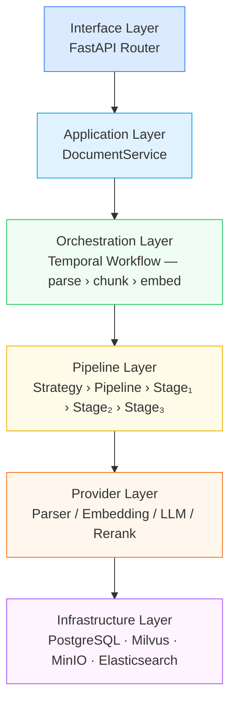
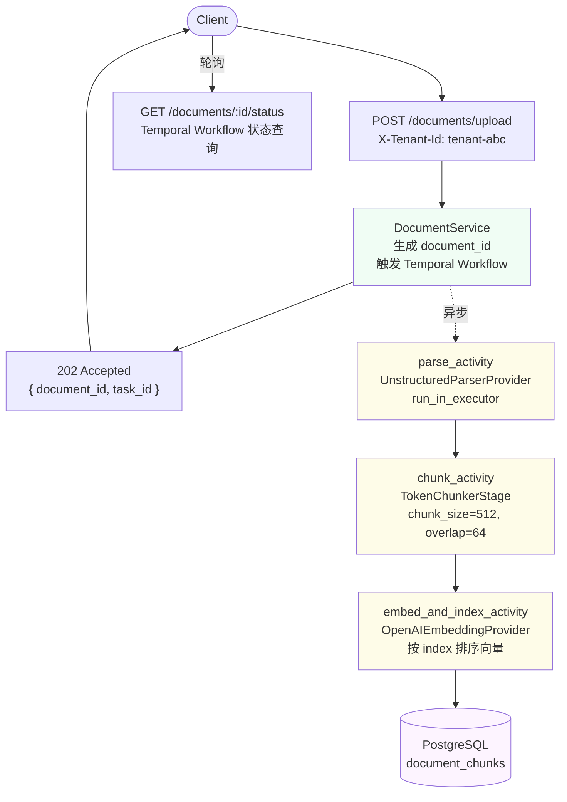

# ArcKnowledge AI — Data Plane

多租户知识库系统的数据面服务，负责文档入库（Ingestion）和知识检索（Retrieval）。

当前版本 **v1.0** 完成了核心 Pipeline 框架和单文档处理链路。

---

## 架构总览

系统分为六层，每层职责单一，依赖方向严格向下：



---

## 核心设计

### 1. Pipeline 框架

Pipeline 由多个 Stage 顺序组成，每个 Stage 只做一件事，输入一种数据类型，输出另一种。Stage 之间通过 `ProcessingContext` 共享租户信息、配置和运行时状态，业务数据通过返回值链式传递。

```
RawFile
  → [ParserStage]       → ParsedDocument
  → [TokenChunkerStage] → List[DocumentChunk]
  → [EmbedStage]        → List[DocumentChunk(with embedding)]
```

Pipeline 采用不可变构建器模式，`then()` 每次返回新的 Pipeline 实例，允许从同一基础 Pipeline 派生出多个变体。

### 2. Provider 抽象

Stage 描述"做什么"，Provider 描述"怎么做"。通过替换 Provider，可以在不修改 Stage 的情况下切换底层实现。

| Provider | 实现 | 用途 |
|---------|------|------|
| `unstructured_parser` | Unstructured 库 | 解析 PDF / Word / HTML |
| `openai_embedding` | OpenAI API | 文本向量化 |
| `ollama_embedding`（规划中） | Ollama | 本地向量化 |
| `paddleocr_parser`（规划中） | PaddleOCR | 扫描件识别 |

### 3. ComponentRegistry

所有 Stage、Provider、Strategy 通过装饰器注册到全局单例 Registry，运行时按名字查找。注册在模块导入时触发，FastAPI `lifespan` 统一 import 所有组件模块。

```python
@registry.stage("parser")
class ParserStage(BaseStage): ...

@registry.provider("openai_embedding")
class OpenAIEmbeddingProvider(EmbeddingProvider): ...
```

### 4. Strategy 模式

不同场景（普通文档、扫描件、付费用户）对应不同的 Pipeline 组合，每种组合封装为一个 Strategy 类。租户配置中指定 `ingestion_strategy`，系统在运行时选择对应的 Pipeline，不需要 if-else 分支。

### 5. Hook 系统

横切能力（配额检查、幂等性、可观测性、租户隔离）通过 Hook 注入 Pipeline，不侵入 Stage 业务代码。Hook 在 5 个时机触发：`PRE_PIPELINE`、`PRE_STAGE`、`POST_STAGE`、`POST_PIPELINE`、`ON_ERROR`。v1.0 的 `hooks = []`，Phase 3 激活。

### 6. Temporal Workflow

文档入库拆成三个独立 Activity，每个 Activity 完成后结果持久化到 Temporal Server。任意 Activity 失败时只从该步骤重试，已完成的步骤不重跑。这是系统可靠性的核心保障。

```
IngestionWorkflow
  ├── parse_activity    （timeout: 10min，retry: 3次）
  ├── chunk_activity    （timeout:  5min，retry: 3次）
  └── embed_and_index_activity（timeout: 15min，retry: 3次）
```

---

## 请求链路



---

## 目录结构

```
arc-knowledge-ai/
├── app/
│   ├── main.py                        # FastAPI 启动，lifespan 组件注册
│   ├── config/settings.py             # Pydantic Settings，读取 .env
│   ├── domain/document.py             # RawFile / DocumentChunk / DocumentStatus
│   ├── pipeline/
│   │   ├── core/                      # context / stage / pipeline / hook / registry
│   │   ├── stages/                    # parser_stage / token_chunker / embed_stage
│   │   └── strategies/                # base_strategy / standard_strategy
│   ├── providers/
│   │   ├── base.py                    # 四个 Provider 接口
│   │   ├── parser/unstructured_provider.py
│   │   └── embedding/openai_embedding.py
│   ├── infrastructure/
│   │   └── postgres/                  # 连接池 / ChunkRepository
│   ├── workflows/
│   │   ├── ingestion_workflow.py      # Temporal Workflow 定义
│   │   └── ingestion_activities.py    # 三个 Activity 实现
│   ├── services/document_service.py   # 业务逻辑，触发 Workflow
│   └── api/routers/document.py        # HTTP 路由
├── tests/
│   └── unit/                          # Pipeline / Stage / Provider 单元测试
├── notes/                             # 设计文档与学习笔记
└── PROGRESS.md                        # 各阶段进度
```

---

## 版本路线图

| 版本 | 目标 | 状态 |
|------|------|------|
| **v1.0** | Pipeline 框架 + 单文档入库链路 | 完成 |
| v2.0 | MinIO 文件存储 + Milvus 向量写入 + OCR 支持 | 规划中 |
| v3.0 | RAG 检索生成（向量 + BM25 + Rerank + LLM 流式） | 规划中 |
| v4.0 | Hook 系统激活（租户隔离 / 配额 / 幂等 / 可观测性） | 规划中 |
| v5.0 | OpenTelemetry + Prometheus + K8s 部署 | 规划中 |

---

## 快速启动

```bash
# 1. 安装依赖
pip install -e ".[dev]"

# 2. 配置环境变量
cp .env.example .env
# 编辑 .env，填入 OPENAI_API_KEY、DATABASE_URL 等

# 3. 启动 FastAPI
uvicorn app.main:app --reload

# 4. 启动 Temporal Worker（另一个终端）
python scripts/start_worker.py
```

---

## 设计文档

详细设计见 `notes/` 目录，按顺序阅读：

| 文档 | 内容 |
|------|------|
| [00-overview](./notes/00-overview.md) | 架构全貌与六个核心抽象 |
| [01-domain-model](./notes/01-domain-model.md) | 领域模型与状态机 |
| [02-context](./notes/02-context.md) | ProcessingContext 设计 |
| [03-stage](./notes/03-stage.md) | BaseStage 与三个实现 |
| [04-pipeline](./notes/04-pipeline.md) | Pipeline 不可变构建器 |
| [05-hook](./notes/05-hook.md) | Hook 系统与横切能力 |
| [06-registry](./notes/06-registry.md) | ComponentRegistry 单例 |
| [07-provider](./notes/07-provider.md) | Provider 抽象与实现 |
| [08-strategy](./notes/08-strategy.md) | Strategy 模式 |
| [09-workflow](./notes/09-workflow.md) | Temporal Workflow 与 Checkpoint |
| [10-service-api](./notes/10-service-api.md) | Service 层与 API 层 |
| [11-full-flow](./notes/11-full-flow.md) | 完整链路追踪 |
| [12-diagrams](./notes/12-diagrams.md) | 架构图（Mermaid） |
