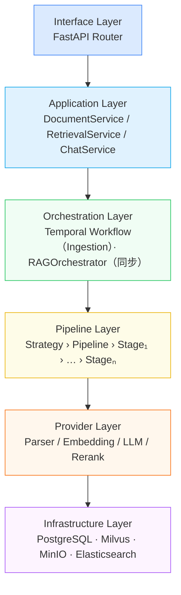
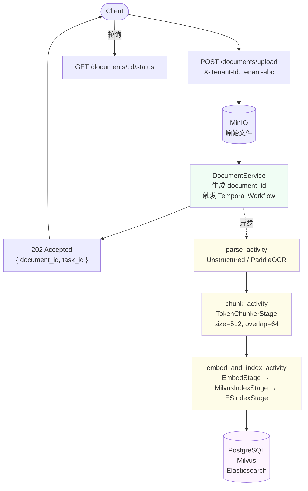
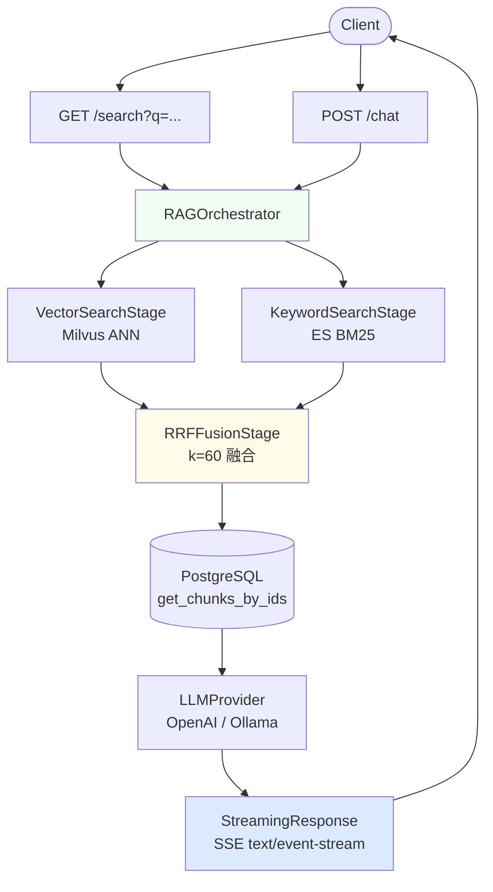

# ArcKnowledge AI — Data Plane

多租户知识库系统的数据面服务，负责文档入库（Ingestion）和知识检索（Retrieval）。

当前版本 **v3.0**，已完成 Pipeline 框架、全量存储接入、混合检索与 RAG 流式问答。

---

## 架构总览

系统分为六层，每层职责单一，依赖方向严格向下：



---

## 核心设计

### 1. Pipeline 框架

Pipeline 由多个 Stage 顺序组成，每个 Stage 只做一件事。Stage 之间通过 `ProcessingContext` 共享租户信息，业务数据通过返回值链式传递。Pipeline 采用不可变构建器模式，`then()` 每次返回新实例。

**Ingestion Pipeline**（Temporal Activity 内运行）：
```
RawFile
  → [ParserStage]       → ParsedDocument
  → [TokenChunkerStage] → list[DocumentChunk]
  → [EmbedStage]        → list[DocumentChunk(with embedding)]
  → [MilvusIndexStage]  → list[DocumentChunk]（写向量）
  → [ESIndexStage]      → list[DocumentChunk]（写全文索引）
```

**Retrieval Pipeline**（单次 HTTP 请求内同步运行）：
```
SearchContext
  → [QueryRewriteStage]  → SearchContext（扩展查询，当前 pass-through）
  → [VectorSearchStage]  → SearchContext（填充 vector_hits）
  → [KeywordSearchStage] → SearchContext（填充 keyword_hits）
  → [RRFFusionStage]     → list[SearchHit]（RRF 融合排序）
  → [RerankStage]        → list[SearchHit]（精排，当前 pass-through）
```

### 2. Provider 抽象

Stage 描述"做什么"，Provider 描述"怎么做"。通过替换 Provider 切换底层实现，不修改 Stage。

| Provider | 实现 | 用途 |
|---------|------|------|
| `unstructured_parser` | Unstructured 库 | 解析 PDF / Word / Excel / HTML |
| `paddleocr_parser` | PaddleOCR | 扫描件 OCR（置信度 ≥ 0.7） |
| `openai_embedding` | OpenAI API | 文本向量化（text-embedding-3-small，1536维） |
| `openai_llm` | OpenAI API | LLM 生成（gpt-4o-mini，流式 + 非流式） |
| `ollama_llm` | Ollama | 本地 LLM（llama3.2，流式） |

### 3. ComponentRegistry

所有 Stage、Provider、Strategy 通过装饰器注册到全局单例。注册在模块 import 时触发，FastAPI `lifespan` 统一导入。

```python
@registry.stage("vector_search")
class VectorSearchStage(BaseStage): ...

@registry.provider("openai_llm")
class OpenAILLMProvider(LLMProvider): ...
```

### 4. Strategy 模式

不同场景对应不同 Pipeline 组合，租户配置中指定 strategy，运行时无需 if-else。

| Strategy | 用途 |
|---------|------|
| `standard` | 标准文档入库（PDF/Word/HTML） |
| `ocr` | 扫描件入库（PaddleOCR 解析） |
| `hybrid` | 混合检索（向量 + BM25 + RRF） |

### 5. Hook 系统（Phase 3 激活）

横切能力（配额、幂等性、可观测性、租户隔离）通过 Hook 注入，不侵入 Stage 代码。当前 `hooks = []`，Phase 3 填入 `[TenantGuard, QuotaGuard, IdempotencyGuard, ObservabilityHook]`。

### 6. 双链路编排

| 链路 | 编排方式 | 原因 |
|------|---------|------|
| Ingestion（入库） | Temporal Workflow（异步） | 分钟级任务，需断点续跑 |
| RAG 问答（检索+生成） | 同步 HTTP + SSE | 秒级延迟要求，流式输出 |

---

## 存储分工

| 存储 | 存什么 | 何时写入 |
|------|--------|---------|
| **MinIO** | 原始文件（PDF/图片） | 上传时（API 层，Temporal 前） |
| **PostgreSQL** | chunk 文本、元数据、文档状态 | embed_and_index_activity |
| **Milvus** | chunk 向量（1536维，HNSW索引） | embed_and_index_activity |
| **Elasticsearch** | chunk 原文（BM25 倒排索引） | embed_and_index_activity |
| **Redis** | 预留（幂等 key，Phase 3） | — |

---

## 请求链路

### 入库链路



### 检索与问答链路



---

## API 接口

| 方法 | 路径 | 说明 |
|------|------|------|
| `POST` | `/documents/upload` | 上传文档，触发异步入库 |
| `GET` | `/documents/{id}/status` | 查询处理状态 |
| `GET` | `/search` | 混合检索，返回 hits + chunk 原文 |
| `POST` | `/chat` | RAG 问答，SSE 流式输出 |
| `GET` | `/health` | 健康检查 |

---

## 目录结构

```
arc-knowledge-ai/
├── app/
│   ├── main.py                        # FastAPI 启动，lifespan 组件注册
│   ├── config/settings.py             # Pydantic Settings，读取 .env
│   ├── domain/
│   │   ├── document.py                # RawFile / DocumentChunk / DocumentStatus
│   │   └── retrieval.py               # RetrievalQuery / SearchHit / SearchContext / RetrievalResult
│   ├── pipeline/
│   │   ├── core/                      # context / stage / pipeline / hook / registry
│   │   ├── stages/
│   │   │   ├── parsing/               # parser_stage
│   │   │   ├── chunking/              # token_chunker
│   │   │   ├── embedding/             # embed_stage / milvus_index_stage / es_index_stage
│   │   │   └── retrieval/             # query_rewrite / vector_search / keyword_search / rrf_fusion / rerank
│   │   └── strategies/
│   │       ├── ingestion/             # standard_strategy / ocr_strategy
│   │       └── retrieval/             # hybrid_strategy
│   ├── providers/
│   │   ├── base.py                    # EmbeddingProvider / LLMProvider / ParserProvider / RerankProvider
│   │   ├── parser/                    # unstructured_provider / paddleocr_provider
│   │   ├── embedding/                 # openai_embedding
│   │   └── llm/                       # openai_llm / ollama_llm
│   ├── infrastructure/
│   │   ├── postgres/                  # 连接池 / ChunkRepository
│   │   ├── milvus/                    # 向量写入 / ANN 检索
│   │   ├── minio/                     # 文件上传 / 下载
│   │   └── elasticsearch/             # BM25 索引 / 全文检索
│   ├── workflows/
│   │   ├── ingestion_workflow.py      # Temporal Workflow 定义
│   │   ├── ingestion_activities.py    # 三个 Activity 实现
│   │   └── rag_orchestrator.py        # RAG 全链路协调器
│   ├── services/
│   │   ├── document_service.py        # 入库业务逻辑
│   │   ├── retrieval_service.py       # 检索业务逻辑
│   │   └── chat_service.py            # 问答业务逻辑
│   └── api/routers/
│       ├── document.py                # /documents 路由
│       ├── search.py                  # /search 路由
│       └── chat.py                    # /chat 路由（SSE）
├── scripts/
│   ├── migrate.py                     # PostgreSQL 建表（幂等）
│   └── start_worker.py                # 启动 Temporal Worker
├── tests/
│   └── unit/                          # Pipeline / Stage / Provider 单元测试
├── docker-compose.yml                 # PostgreSQL / MinIO / Milvus / ES / Redis / Temporal 一键启动
├── notes/                             # 设计文档与学习笔记
└── PROGRESS.md                        # 各阶段进度
```

---

## 版本路线图

| 版本 | 目标 | 状态 |
|------|------|------|
| **v1.0** | Pipeline 框架 + 单文档入库链路 | ✅ 完成 |
| **v2.0** | MinIO 文件存储 + Milvus 向量写入 + OCR 支持 | ✅ 完成 |
| **v3.0** | RAG 检索生成（混合检索 + RRF + LLM 流式） | ✅ 完成 |
| v4.0 | Hook 系统激活（租户隔离 / 配额 / 幂等 / 可观测性） | 规划中 |
| v5.0 | OpenTelemetry + Prometheus + K8s 部署 | 规划中 |
| v6.0 | 多模型路由（ModelHub + 熔断 + Ollama 热切换） | 规划中 |

---

## 快速启动

```bash
# 1. 启动所有依赖（PostgreSQL / MinIO / Milvus / ES / Redis / Temporal）
docker-compose up -d

# 2. 建表
python scripts/migrate.py

# 3. 配置环境变量
cp .env.example .env
# 编辑 .env，填入 OPENAI_API_KEY

# 4. 启动 FastAPI
uvicorn app.main:app --reload

# 5. 启动 Temporal Worker（另一个终端）
python scripts/start_worker.py
```

---

## 设计文档

详细设计见 `notes/` 目录，按顺序阅读：

### Phase 0（v1.0）— Pipeline 框架

| 文档 | 内容 |
|------|------|
| [00-overview](./notes/00-overview.md) | 架构全貌与六个核心抽象 |
| [01-domain-model](./notes/01-domain-model.md) | 领域模型与状态机 |
| [02-context](./notes/02-context.md) | ProcessingContext 设计 |
| [03-stage](./notes/03-stage.md) | BaseStage 与实现 |
| [04-pipeline](./notes/04-pipeline.md) | Pipeline 不可变构建器 |
| [05-hook](./notes/05-hook.md) | Hook 系统与横切能力 |
| [06-registry](./notes/06-registry.md) | ComponentRegistry 单例 |
| [07-provider](./notes/07-provider.md) | Provider 抽象与实现 |
| [08-strategy](./notes/08-strategy.md) | Strategy 模式 |
| [09-workflow](./notes/09-workflow.md) | Temporal Workflow 与 Checkpoint |
| [10-service-api](./notes/10-service-api.md) | Service 层与 API 层 |
| [11-full-flow](./notes/11-full-flow.md) | 完整链路追踪 v1 |
| [12-diagrams](./notes/12-diagrams.md) | 架构图（Mermaid） |

### Phase 1（v2.0）— 完整 Ingestion

| 文档 | 内容 |
|------|------|
| [13-infrastructure](./notes/13-infrastructure.md) | MinIO / Milvus / PG 分工，run_in_executor 设计 |
| [14-full-flow-v2](./notes/14-full-flow-v2.md) | 完整链路追踪 v2（含 MinIO + Milvus） |

### Phase 2（v3.0）— RAG 检索生成

| 文档 | 内容 |
|------|------|
| [15-retrieval-pipeline](./notes/15-retrieval-pipeline.md) | SearchContext、5 个 Retrieval Stage、RRF 算法 |
| [16-full-flow-v3](./notes/16-full-flow-v3.md) | 完整链路追踪 v3（搜索 + RAG 问答 SSE） |
