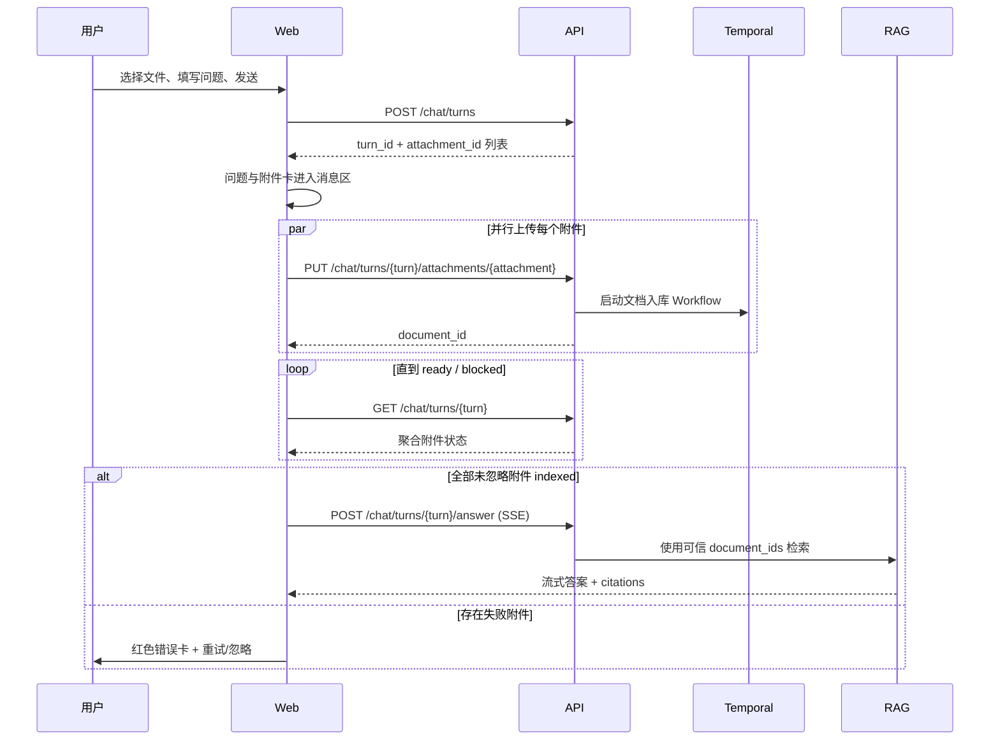

# 聊天附件异步入库与自动问答设计

日期：2026-08-28
状态：待实施
涉及项目：`arc-knowledge-ai`、`arc-knowledge-web`

## 1. 背景

当前聊天输入框允许选择文件，但文件一经选择就立刻调用文档上传接口，入库状态只保存在 `ChatInput.vue` 的组件内存中。文件不会与用户消息建立关系，`POST /chat` 也不知道本轮消息包含哪些附件，因此用户即使刚上传文件，问题仍会立即检索整个工作空间。

目标是实现知识库产品常见的附件问答体验：用户发送问题后，问题和附件卡立即进入消息区；系统等待附件走完 MinerU、分块、Embedding 和索引流程；全部附件就绪后自动生成答案；失败附件显示明确错误并支持重试或忽略。

## 2. 已确认的产品规则

1. 聊天附件永久加入当前工作空间知识库，不是临时文件。
2. 本条消息包含附件时，本次回答只检索本条消息中成功入库且未忽略的附件。
3. 后续没有附件的消息恢复检索整个当前工作空间。
4. 发送后问题与附件立即离开输入框，进入对话消息区。
5. 任一未忽略附件失败时，不自动回答；用户可以重试或忽略失败附件。
6. 所有附件被忽略时不自动退化为全空间检索，必须允许用户给原消息补充附件或取消本轮。
7. 上一条消息仍在等待附件或生成答案时，当前会话不能发送下一条消息。
8. 忙碌期间 textarea 保持可编辑并保留草稿，仅禁用发送按钮与 Enter 提交。
9. 初期要求用户同时提供问题，不支持只发文件不提问。

## 3. 方案选择

### 3.1 纯前端编排

前端上传并轮询文档，全部完成后调用现有 `/chat`。改动小，但页面刷新会丢失附件与触发状态，并存在重复回答风险，因此不采用。

### 3.2 持久化附件消息状态机（采用）

后端持久化用户消息、附件关系和回答状态；前端上传、展示、轮询并在就绪后调用幂等回答接口。刷新页面可以从后端恢复，且不需要新增独立的回答 Worker。

### 3.3 完全后端异步回答

由后台任务等待入库并生成答案，前端只订阅事件。它最耐断线，但需要回答任务队列、流式内容持久化和断点续传，超出当前需求，保留为后续演进方向。

## 4. 总体流程



## 5. 状态模型

### 5.1 附件状态

服务端持久化上传阶段，入库阶段以 `documents.status` 为事实来源。API 输出统一状态：

```text
pending_upload
  -> uploading            # 仅前端本地进度
  -> ingesting            # 已上传并启动 Temporal
  -> indexed
  -> failed
  -> ignored
```

映射规则：

- `ignored=true`：`ignored`
- 未关联 `document_id` 且上传失败：`failed`
- 未关联 `document_id`：`pending_upload`
- 文档状态为 `indexed`：`indexed`
- 文档状态为 `failed`：`failed`
- 其他文档状态：`ingesting`

### 5.2 本轮就绪状态

`readiness` 不重复存储，由附件状态实时计算：

- 存在待上传或入库中附件：`ingesting`
- 存在未忽略失败附件：`blocked`
- 至少一个未忽略附件且全部 `indexed`：`ready`
- 所有附件被忽略：`empty`

### 5.3 回答状态

附件型用户消息在 `messages.processing_status` 中持久化：

```text
waiting_files -> answering -> completed
      |              \-----> answer_failed -> answering
      \--------------------> cancelled
```

普通历史消息和无附件消息的 `processing_status` 为 `NULL`，保持现有流程兼容。

## 6. 数据模型

### 6.1 messages 扩展

```sql
ALTER TABLE messages
    ADD COLUMN processing_status VARCHAR(32),
    ADD COLUMN processing_error TEXT,
    ADD COLUMN client_request_id UUID;

CREATE UNIQUE INDEX uq_messages_client_request
    ON messages (tenant_id, user_id, client_request_id)
    WHERE client_request_id IS NOT NULL;
```

`client_request_id` 用于创建附件消息时的幂等控制。重复提交返回原消息，而不是创建第二轮。

### 6.2 message_attachments

```sql
CREATE TABLE message_attachments (
    attachment_id   UUID PRIMARY KEY DEFAULT gen_random_uuid(),
    message_id      UUID NOT NULL REFERENCES messages(message_id) ON DELETE CASCADE,
    tenant_id       VARCHAR(64) NOT NULL,
    space_id        UUID NOT NULL REFERENCES spaces(id),
    client_id       VARCHAR(128) NOT NULL,
    document_id     UUID REFERENCES documents(id),
    file_name       VARCHAR(512) NOT NULL,
    mime_type       VARCHAR(128) NOT NULL,
    file_size       BIGINT NOT NULL,
    upload_status   VARCHAR(32) NOT NULL DEFAULT 'pending',
    upload_error    TEXT,
    ignored         BOOLEAN NOT NULL DEFAULT FALSE,
    created_at      TIMESTAMPTZ NOT NULL DEFAULT NOW(),
    updated_at      TIMESTAMPTZ NOT NULL DEFAULT NOW(),
    CONSTRAINT uq_message_attachment_client UNIQUE (message_id, client_id)
);

CREATE INDEX idx_message_attachments_message
    ON message_attachments (message_id);
```

不在附件表复制文档入库状态，避免与 `documents.status` 产生双重事实来源。

## 7. API 契约

### 7.1 创建附件消息

```http
POST /chat/turns
Content-Type: application/json
```

请求：

```json
{
  "client_request_id": "uuid",
  "session_id": "uuid",
  "query": "这个文件中的工程造价是多少？",
  "attachments": [
    {
      "client_id": "uuid",
      "file_name": "投标文件.pdf",
      "mime_type": "application/pdf",
      "file_size": 123456
    }
  ]
}
```

行为：

1. 校验会话属于当前用户、租户及空间。
2. 校验问题非空、附件数量、类型和声明大小。
3. 在同一事务中创建用户消息及附件占位。
4. 返回 `turn_id`（即用户消息 `message_id`）和附件 ID。

重复 `client_request_id` 返回已有结果。

### 7.2 上传附件

```http
PUT /chat/turns/{turn_id}/attachments/{attachment_id}
Content-Type: multipart/form-data
```

行为：

1. 校验 turn、attachment、tenant、user、session 和 space 关系。
2. 重新校验实际文件名、MIME 与字节大小，不信任创建占位时的声明。
3. 写入 MinIO，创建 `documents` 记录并关联附件。
4. 启动现有 `IngestionWorkflow`。
5. 将 `upload_status` 设为 `uploaded`。

若附件已关联文档，则幂等返回原 `document_id`。

### 7.3 查询本轮状态

```http
GET /chat/turns/{turn_id}
```

响应包含：

- 用户消息内容
- `readiness`
- `answer_status`
- 每个附件的统一状态、错误、文档 ID
- 已存在的 assistant 消息及 citations（若已完成）

前端每 2 秒轮询，加入少量 jitter；达到 `blocked`、`empty` 或 `completed` 后停止。

### 7.4 重试附件

上传阶段失败时，用户需要重新选择本地文件，再调用原 PUT 接口。

入库阶段失败时：

```http
POST /chat/turns/{turn_id}/attachments/{attachment_id}/retry
```

服务端复用 MinIO 原文件，先按 `document_id` 清理可能残留的 Milvus、Elasticsearch 和 PostgreSQL chunk 数据，清空错误并启动新的 Temporal run。Workflow ID 使用带 attempt/UUID 的唯一值，避免与已关闭的失败 Workflow 冲突。

### 7.5 忽略附件

```http
PATCH /chat/turns/{turn_id}/attachments/{attachment_id}
```

```json
{"ignored": true}
```

忽略不会删除已经永久进入知识库的文档，只表示本轮回答不再等待或检索它。

### 7.6 补充附件或取消本轮

当附件失败或全部被忽略时，可以给同一条用户消息补充附件：

```http
POST /chat/turns/{turn_id}/attachments
```

请求体与创建 turn 时的单个附件描述一致。后端创建新的附件占位，随后前端调用原 PUT 上传接口。消息正文和 turn ID 均不改变。

用户也可以放弃本轮：

```http
POST /chat/turns/{turn_id}/cancel
```

只有 `waiting_files` 或 `answer_failed` 状态允许取消。取消后将 processing status 置为 `cancelled`，停止轮询并解除当前会话的发送锁。已成功入库的文件仍永久保留在知识库中。

### 7.7 自动回答

```http
POST /chat/turns/{turn_id}/answer
Accept: text/event-stream
```

回答前必须在数据库事务中：

1. 锁定用户消息行。
2. 重新计算附件 readiness。
3. 从附件关系中取得未忽略、已索引的 `document_ids`。
4. 仅当状态可重试时原子切换为 `answering`。

`answering` 或 `completed` 状态的重复请求不得再次生成回答。

SSE 继续沿用现有 `delta`、`citations`、`[DONE]` 协议。生成失败时把消息标记为 `answer_failed` 并允许重试。

## 8. 检索隔离

新增正式的 `document_ids` 字段，不借用 metadata 过滤：

```text
ChatRequest
  -> RAGOrchestrator.retrieve
  -> RetrievalQuery
  -> VectorSearchStage / KeywordSearchStage
  -> Milvus / Elasticsearch
```

Milvus 在 tenant、space 条件后追加经过 UUID 校验的：

```text
document_id in ["...", "..."]
```

Elasticsearch 添加：

```json
{"terms": {"document_id": ["...", "..."]}}
```

后端不得接受客户端直接指定的任意 `document_ids`。`/answer` 只能从当前用户消息的附件关系生成该列表。

附件限定回答保留最近对话历史以理解代词和追问，但不载入其他工作空间文档或长期语义记忆事实。提示词要求只依据附件检索上下文作答；证据不足时明确说明，不能用模型常识补足文档结论。

## 9. 回答持久化与异常边界

现有 ChatService 在生成后通过后台任务保存回答和引用。附件自动回答需要把关键持久化前移：

1. 用户消息已经由 `/chat/turns` 保存，ChatService 不得重复保存。
2. 流式生成完成后，assistant 消息和 citations 必须在返回 `[DONE]` 前完成事务性持久化。
3. 摘要压缩、长期记忆提取等非关键工作仍可后台执行。
4. 客户端主动中断或网络断开时，将本轮置为 `answer_failed`，允许重新生成。
5. 回答重试复用原用户消息，不产生重复问题记录。

## 10. 前端设计

### 10.1 组件

```text
ChatInput.vue
  └─ DraftAttachmentChip.vue       # 发送前，可移除

MessageBubble.vue
  └─ MessageAttachmentCard.vue     # 发送后，持久化状态
```

发送前文件只作为草稿附件展示。点击发送后，问题与文件卡立即乐观写入消息列表，输入框清空；后端创建失败时，消息卡显示可重试错误，而不是把内容塞回输入框。

### 10.2 Store

`src/stores/chat.ts` 增加：

- `pendingFiles`
- `activeTurn`
- `sessionBusy`
- `submitTurn()`
- `pollTurn()` / `stopTurnPolling()`
- `answerTurn()`
- `retryAttachment()`
- `ignoreAttachment()`
- `resumePendingTurn()`

`sessionBusy` 在附件等待、阻塞或回答生成期间为 true，在 `completed` 或 `cancelled` 后解除。textarea 不禁用，`canSend` 和 Enter 提交受 `sessionBusy` 控制。草稿在当前会话内保留；切换会话时不把草稿发送到其他会话。

### 10.3 消息展示

- 上传中：进度条和百分比。
- 等待/入库：灰色旋转状态与“正在入库”。
- 成功：绿色对勾与“已就绪”。
- 失败：红色感叹号、简短错误、重试与忽略操作。
- 所有附件均失败或被忽略：显示“补充附件”和“取消本轮”。
- 全部就绪：自动切换到现有 assistant 流式光标。
- 回答失败：显示“重新生成回答”，不要求重新入库成功附件。

### 10.4 刷新恢复

`GET /sessions/{session_id}/messages` 扩展返回 processing status 和附件。进入会话后：

- `waiting_files`：恢复轮询。
- readiness 为 `ready` 且尚未回答：尝试调用幂等 answer 接口。
- `answering`：查询状态；若服务端判断前一次流已中断，则转为 `answer_failed`。
- `completed`：直接展示持久化回答和 citations。

## 11. 普通聊天兼容性

无附件消息继续使用现有 `/chat` SSE 流程，不创建附件占位，不增加等待阶段。现有文档管理上传接口 `/documents/upload` 保持不变。

会话消息响应只做向后兼容的字段扩展，历史消息没有附件时返回空数组、processing status 为 null。

## 12. 限制与配置

初始默认：

- 每条消息最多 5 个附件。
- 单文件大小沿用文档上传限制，必须在服务端配置，不在前端硬编码为唯一防线。
- MIME 白名单前后端一致，但服务端为最终裁决者。
- MinerU 当前并发为 1，多文件会在后端排队，UI 统一显示“正在入库”。

## 13. 测试策略

### 13.1 后端

- 创建附件消息、重复 client request 的幂等测试。
- 会话、附件、文档的 tenant/user/space 越权测试。
- 附件未就绪时 answer 被拒绝。
- readiness 的 ingesting、blocked、ready、empty 状态测试。
- 失败附件重试与忽略状态测试。
- 重复 answer 请求只允许一次进入 answering。
- document_ids 同时下推到 Milvus 与 Elasticsearch。
- 附件型回答不重复保存用户消息。
- assistant 与 citations 在完成前持久化。
- 普通聊天回归测试。

### 13.2 前端

- 附件从输入框移动到消息区。
- 上传进度、入库成功和失败卡片。
- sessionBusy 时可编辑但不可提交。
- ready 后只触发一次自动回答。
- retry、ignore、answer retry。
- 全部附件被忽略后可以补充附件或取消本轮，不会锁死会话。
- 页面刷新与切换会话后的恢复。
- TypeScript 构建通过。

### 13.3 端到端

使用一个小 PDF 验证：

1. 发送后立即看到消息与附件卡。
2. 入库期间输入框可写但不可发送。
3. MinerU、分块、Embedding、Milvus、ES 全部完成。
4. 自动回答仅引用该 PDF。
5. 刷新页面后消息、附件状态、回答和 citations 保留。
6. 模拟入库失败时显示红色错误并可重试/忽略。

## 14. 实施边界

本次不实现：

- 临时附件或会话结束自动删除。
- 后台独立回答 Worker。
- SSE token 级断点续传。
- 无问题的“仅上传文件”消息。
- 多条待回答消息排队。

这些能力可以在持久化附件消息模型上继续演进，不影响本次接口方向。

## 15. 验收标准

1. 用户发送附件问题后，输入框立即清空，消息区立即出现问题与附件卡。
2. 附件完成入库前不会发起 RAG 回答。
3. 成功后自动回答，且 citations 只能来自本条消息附件。
4. 失败附件显示红色感叹号、错误信息、重试和忽略；全部无可用附件时可补充附件或取消本轮。
5. 等待和回答期间可编辑草稿但不能发送下一条消息。
6. 刷新或重新进入会话后可以恢复未完成状态。
7. 重复请求不会创建重复消息、文档或回答。
8. 无附件聊天和文档管理上传流程无回归。
