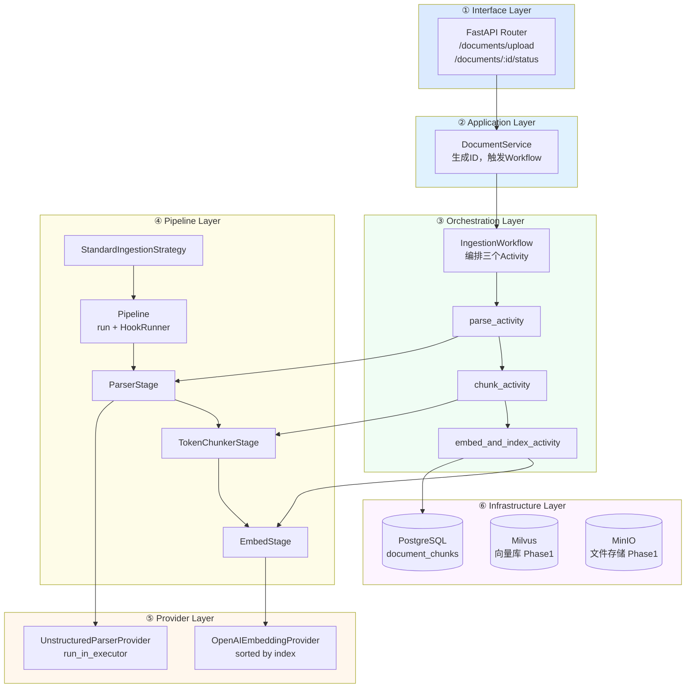
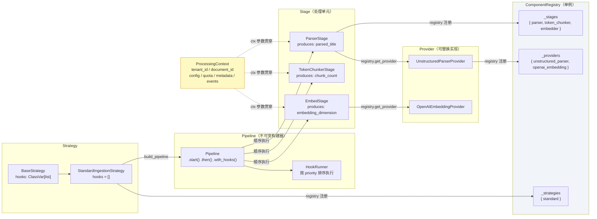
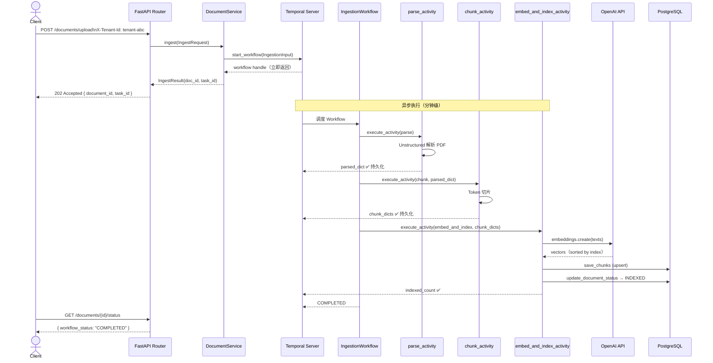
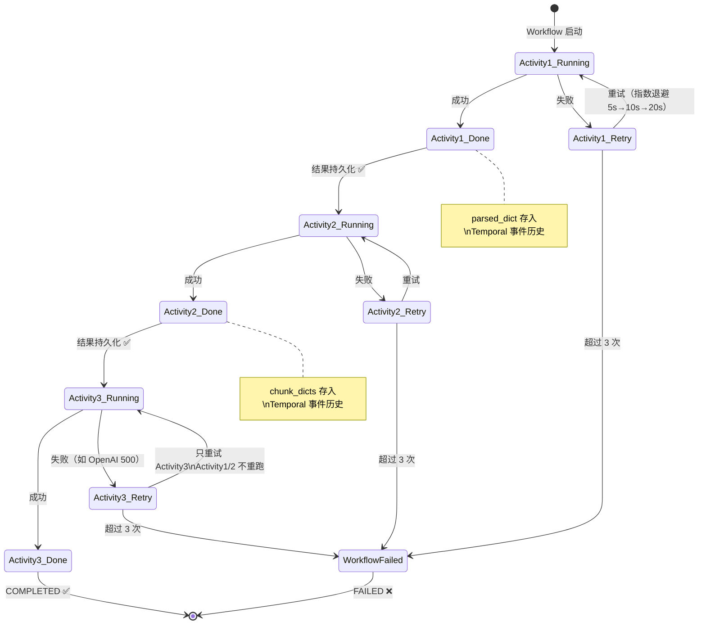
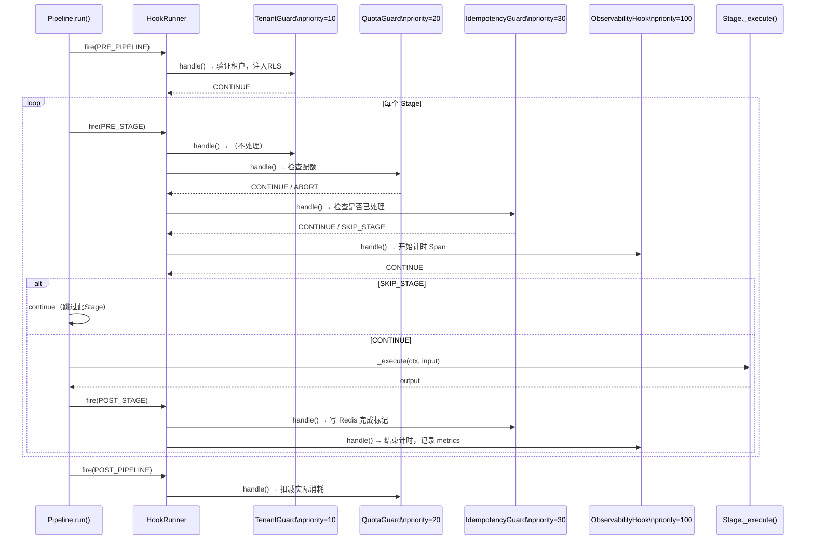

# 12 — v1.0 架构全图（Mermaid）

快速回顾用，四张图从不同视角描述同一套系统。

---

## 图一：六层架构总览



---

## 图二：核心组件关系图



---

## 图三：一次请求的时序图



---

## 图四：Temporal Checkpoint 重试机制



---

## 图五：Hook 执行时序（Phase 3 激活后）



---

## 一张图记住核心关系

```
HTTP请求 → [API] → [Service] → [Temporal] → [Activities]
                                                   │
                                            每个Activity内：
                                            _make_context(inp) → ctx
                                            registry.get_stage() → Stage
                                            Stage._execute(ctx, input)
                                                   │
                                            Stage内：
                                            registry.get_provider() → Provider
                                            provider.do_work(ctx, input)
                                                   │
                                            返回结果 → 下一个Activity
```

**ctx 是唯一贯穿所有层的对象，但不跨 Activity 传递（每次重建）。**
